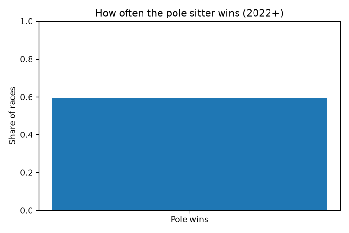
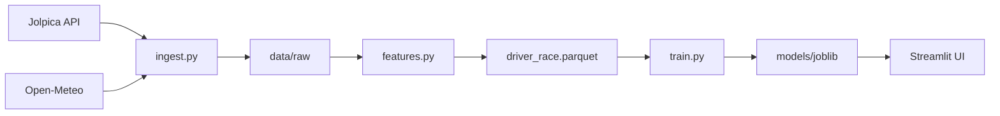

<p align="center">
  
</p>

<p align="center">
  <strong>ML-powered F1 race-winner predictions from free historical data</strong>
</p>

<p align="center">
  <a href="https://www.python.org/"></a>
  <a href="https://streamlit.io/"></a>
  <a href="https://scikit-learn.org/"></a>
  
  
</p>

---

**Pitstop Oracle** predicts Formula 1 race winners using qualifying, grid, championship form, and weather — trained on 2022+ seasons and served through a multi-page **Streamlit** dashboard. No telemetry, no paid APIs, no betting advice.

<p align="center">
  <a href="docs/README.md"><strong>Documentation</strong></a> ·
  <a href="ml/README.md">ML pipeline</a> ·
  <a href="ml/reports/EVAL.md">Evaluation</a>
</p>

## Screenshots

| This Weekend | Race Explorer |
|:---:|:---:|
| <a href="docs/README.md#this-weekend"></a> | <a href="docs/README.md#race-explorer"></a> |
| <sub>Next GP prediction — works before qualifying</sub> | <sub>Browse history · model vs actual winner</sub> |

| Fantasy Lab | Model Performance |
|:---:|:---:|
| <a href="docs/README.md#fantasy-lab"></a> | <a href="docs/README.md#model-performance"></a> |
| <sub>Rain + grid penalty what-if scenarios</sub> | <sub>Honest accuracy vs pole baseline</sub> |

## Highlights

| | Feature | Details |
|:---:|:---|:---|
| 🏁 | **Weekend-first** | Auto-picks the next GP (e.g. Monza) — even pre-qualifying |
| 🧪 | **Fantasy Lab** | Toggle wet race or grid penalties; see probabilities shift live |
| 📊 | **Honest metrics** | Pole sitter still beats ML on test — we report that openly |

## Quick start

```bash
git clone https://github.com/your-username/pitstopOracle-F1AI.git
cd pitstopOracle-F1AI/ml

python3 -m venv .venv
source .venv/bin/activate
pip install -r requirements.txt

python run_pipeline.py      # ingest + train (first run ~10 min)
streamlit run app.py        # open dashboard
```

Predict one race from the CLI:

```bash
python predict_race.py --season 2026 --round 13
```

## Results snapshot

Time split: train **2022–2026** (walk-forward eval in [`ml/reports/metrics.json`](ml/reports/metrics.json)).

| Method | Test winner hit rate |
|:---|---:|
| **Pole baseline** | **69.4%** |
| Championship leader | 30.6% |
| Logistic regression | 52.8% |
| Random forest | 58.3% |
| RF top-3 (winner in top 3) | 100% |

Pole wins ~60% of races in this era — the model's value is narrowing the field, not magic.

<p align="center">
  
</p>

## How it works



Details: [Architecture](docs/ARCHITECTURE.md)

## Project layout

```
pitstopOracle-F1AI/
├── docs/                 # Documentation + README screenshots
├── ml/                   # Python pipeline + Streamlit app
│   ├── f1ml/             # ingest, features, train, predict, ui
│   ├── pages/            # Dashboard pages
│   └── run_pipeline.py
└── dataCollectionService/  # Future Postgres warehouse (optional)
```

## Data sources

- **[Jolpica F1](https://github.com/jolpica/jolpica-f1)** — free Ergast-compatible results API
- **[Open-Meteo](https://open-meteo.com/)** — historical weather

## Refresh screenshots

After retraining, regenerate README graphics:

```bash
cd ml && python scripts/generate_docs_assets.py
```

## Disclaimer

Hobby ML project for learning. **Not betting advice.** F1 outcomes are noisy; qualifying is the strongest signal.

<p align="center">
  <sub>Built with pandas, scikit-learn, Plotly, and Streamlit</sub>
</p>
