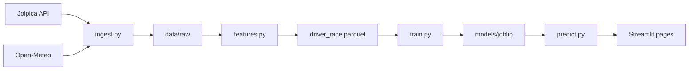

# Architecture

Pitstop Oracle is a small ML pipeline plus a Streamlit dashboard. Data flows in one direction: free APIs → Parquet files → feature table → trained models → predictions in the UI.

## Pipeline overview

## Module map

| Module | Role |
|---|---|
| [`ml/f1ml/ingest.py`](../ml/f1ml/ingest.py) | Pull races, results, qualifying, standings, weather from Jolpica + Open-Meteo; cache to `data/raw/` |
| [`ml/f1ml/features.py`](../ml/f1ml/features.py) | One row per driver per race; rolling form, championship position, labels (`won`, `podium`) |
| [`ml/f1ml/train.py`](../ml/f1ml/train.py) | Time-based split, baselines, Random Forest + Logistic Regression, writes `reports/` |
| [`ml/f1ml/predict.py`](../ml/f1ml/predict.py) | Load models, score races, `resolve_race_features` for upcoming GPs |
| [`ml/f1ml/ui/`](../ml/f1ml/ui/) | Theme, Plotly charts, shared Streamlit components |
| [`ml/pages/`](../ml/pages/) | This Weekend, Race Explorer, Fantasy Lab, Model Performance |

## Training split

- **Train:** 2022–2024 seasons
- **Test:** 2025–2026 (held-out later seasons — no random shuffle)

The first baseline is always **pole sitter**. ML is only useful if it beats that on the test set.

## Upcoming race predictions

For races not yet in `driver_race.parquet` (e.g. Monza before qualifying):

1. `resolve_race_features(season, round)` tries completed race data
2. Falls back to `build_upcoming_race_features()` using the latest completed round in the season for driver lineup and form
3. Championship standings come from standings after that round
4. Qualifying columns are `NaN` until quali is ingested — model imputes them

## Future warehouse

[`dataCollectionService/`](../dataCollectionService/) is a TypeScript + Postgres schema for a future API. It is **not** required for v1 training or the dashboard.
