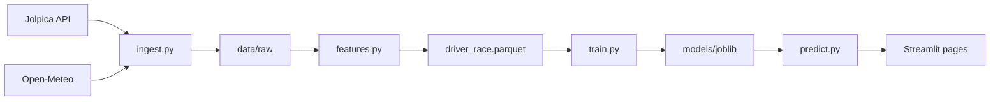

# Architecture

Pitstop Oracle is a small ML pipeline plus a Streamlit dashboard. Data flows in one direction: free APIs → Parquet files → feature table → trained models → predictions in the UI.

## Pipeline overview

## Module map

| Module | Role |
|---|---|
| [`ml/f1ml/ingest.py`](../ml/f1ml/ingest.py) | Pull races, results, qualifying, standings, weather from Jolpica + Open-Meteo; cache to `data/raw/` |
| [`ml/f1ml/features.py`](../ml/f1ml/features.py) | One row per driver per race; rolling form, circuit overtaking index, teammate H2H |
| [`ml/f1ml/specs.py`](../ml/f1ml/specs.py) | Pre-quali vs post-quali feature definitions |
| [`ml/f1ml/train.py`](../ml/f1ml/train.py) | Dual-mode training, walk-forward eval, gradient boosting + logreg baselines |
| [`ml/f1ml/predict.py`](../ml/f1ml/predict.py) | Weekend card API: win, podium, DNF, finish, fantasy points |
| [`ml/f1ml/fantasy.py`](../ml/f1ml/fantasy.py) | F1 Fantasy-style expected points engine |
| [`ml/f1ml/eval.py`](../ml/f1ml/eval.py) | Log-loss, Brier, calibration, rank correlation |
| [`ml/f1ml/ui/`](../ml/f1ml/ui/) | Theme, Plotly charts, shared Streamlit components |
| [`ml/pages/`](../ml/pages/) | This Weekend, Race Explorer, Fantasy Lab, Model Performance |

## Training split

- **Train:** 2022–2026 seasons (includes completed 2026 races)
- **Eval:** walk-forward by season (no fixed held-out test split)
- **Modes:** separate `pre_quali` and `post_quali` model bundles in `ml/models/`

The first baseline is always **pole sitter** (post-quali only). Pre-quali is compared to equal field and championship leader.

## Upcoming race predictions

For races not yet in `driver_race.parquet` (e.g. Monza before qualifying):

1. `resolve_race_features(season, round)` tries completed race data
2. Falls back to `build_upcoming_race_features()` using the latest completed round in the season for driver lineup and form
3. Championship standings come from standings after that round
4. Qualifying columns are merged from `data/raw/qualifying.parquet` when available — model imputes missing values otherwise

## Future warehouse

[`dataCollectionService/`](../dataCollectionService/) is a TypeScript + Postgres schema for a future API. It is **not** required for v1 training or the dashboard.
