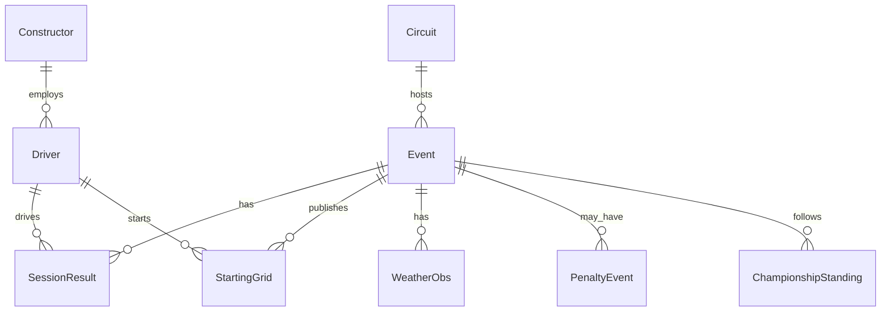

# Pitstop Oracle — canonical dataset

This document defines the **stable data contract** used by feature engineering, models, and the UI. Vendor APIs (Jolpica, OpenF1, Open-Meteo) are mapped into these shapes via adapters in [`ml/f1ml/adapters/`](../ml/f1ml/adapters/).

## Design rules

1. **One row per driver per race** in the feature table (`driver_race.parquet`).
2. **Stable IDs** — `driver_id`, `constructor_id`, `circuit_id` match Ergast/Jolpica IDs.
3. **Qualifying position ≠ grid position** — penalties live in `starting_grid`.
4. **No leakage** — championship standings for round R are after round R−1; rolling features are shifted.
5. **Features never import vendors** — only canonical/raw parquet paths.

## Entity relations



## Storage layout

| Path | Grain | Source adapter |
|---|---|---|
| `data/raw/races.parquet` | season × round | Jolpica |
| `data/raw/results.parquet` | season × round × driver | Jolpica |
| `data/raw/qualifying.parquet` | season × round × driver | Jolpica |
| `data/raw/sprints.parquet` | season × round × driver | Jolpica |
| `data/raw/standings.parquet` | season × after_round × driver | Jolpica |
| `data/raw/weather.parquet` | season × round | Open-Meteo archive |
| `data/canonical/starting_grid.parquet` | season × round × driver | OpenF1 + manual |
| `data/canonical/fp_pace.parquet` | season × round × driver × session | OpenF1 |
| `data/canonical/weather_forecast.parquet` | season × round | Open-Meteo forecast |
| `data/manual/starting_grid.csv` | overrides | Manual |
| `data/manual/fantasy_prices.csv` | season × round × entity | Manual |
| `data/processed/driver_race.parquet` | season × round × driver | `features.build_driver_race()` |

## Starting grid schema

| Column | Type | Description |
|---|---|---|
| `season` | int | Championship year |
| `round` | int | Grand Prix round |
| `driver_id` | str | Ergast driver ID |
| `grid_position` | int | Published race start (1 = front) |
| `quali_position` | int? | Qualifying position before penalties |
| `source` | str | `openf1`, `manual`, etc. |
| `as_of` | str | ISO timestamp when grid was captured |

Derived feature: `grid_vs_quali = grid - quali_position`.

## Feature table (processed)

Key columns used by models — see [`ml/f1ml/specs.py`](../ml/f1ml/specs.py) for the full list.

| Column group | Examples |
|---|---|
| Identity | `driver_id`, `constructor_id`, `season`, `round`, `circuit_id` |
| Targets | `won`, `podium`, `dnf`, `position` |
| Pre-race form | `champ_position_before`, `driver_id_avg_finish_last_5`, … |
| Post-quali | `quali_position`, `grid`, `grid_vs_quali`, `best_quali_seconds` |
| Context | `is_wet`, `precipitation_mm`, `has_sprint`, `circuit_grid_to_finish_delta` |
| Practice pace | `fp2_best_lap_delta`, `fp3_best_lap_delta` |

## Adapter protocol

```python
class SourceAdapter(ABC):
    def pull(self, season: int, round_num: int | None = None) -> CanonicalBundle: ...
```

Implementations:

- `JolpicaAdapter` — historical results, quali, standings → `data/raw/`
- `OpenF1Adapter` — starting grid, FP pace → `data/canonical/`
- `OpenMeteoForecastAdapter` — race-day forecast → `data/canonical/`
- `ManualAdapter` — CSV overrides for grid and fantasy prices

## Switching data sources

To replace Jolpica:

1. Implement a new adapter that writes the **same raw parquet schemas** (or extends `CanonicalBundle`).
2. Keep `driver_id` / `constructor_id` stable via an `id_map` table if vendor IDs differ.
3. Re-run `python run_pipeline.py` — features and models read only canonical paths.

Live weekend grid without Jolpica: use OpenF1 `starting_grid` + `manual/starting_grid.csv` fallback.

## Null semantics

| Field | When null |
|---|---|
| `quali_position` | Pre-quali forecast or driver did not set a time |
| `grid` | Pre-quali; falls back to quali only if no starting grid source |
| `fp*_best_lap_delta` | Practice data not yet ingested |
| `champ_position_before` | Round 1 (no prior standings) |
