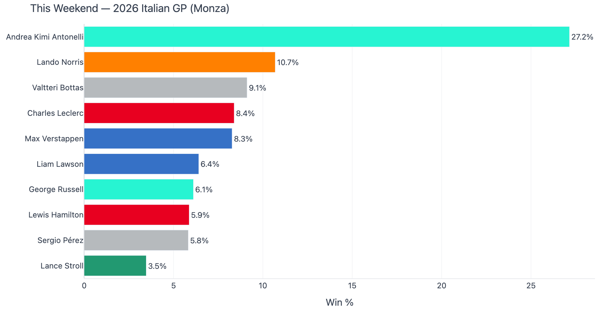
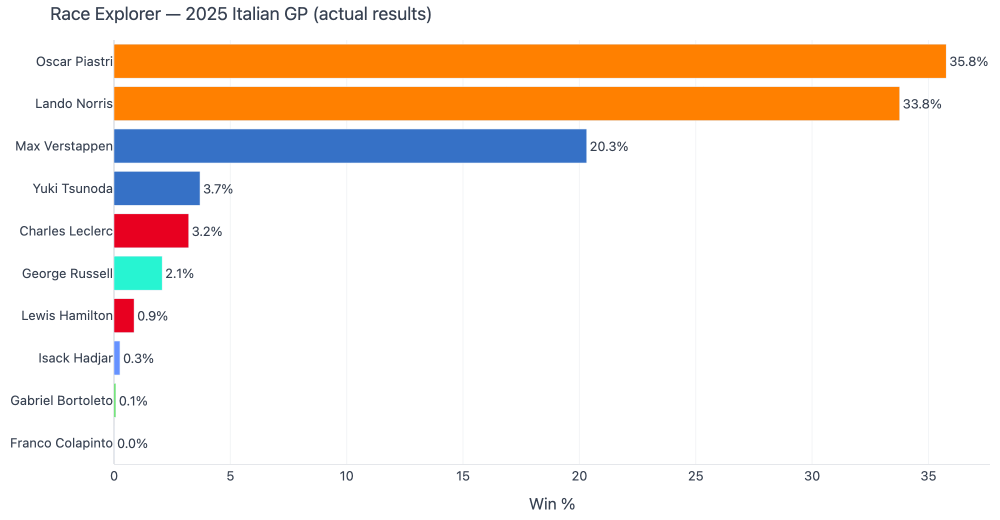
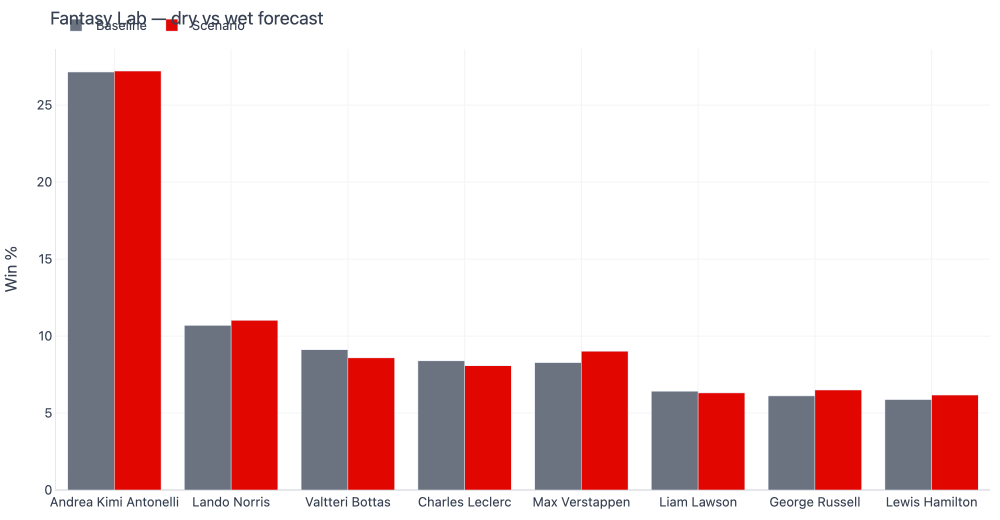
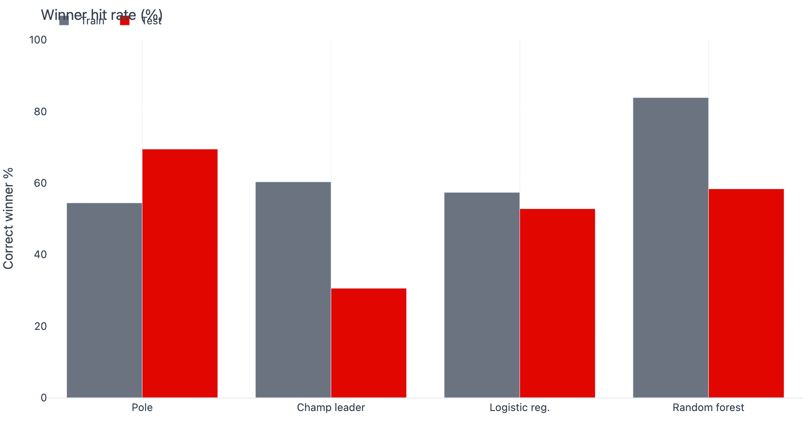

# Pitstop Oracle — Documentation

ML-powered Formula 1 race-winner predictions from free historical data (2022+). Not telemetry, not betting advice — a learning project that ships a real dashboard.

[Back to project README](../README.md)

## Dashboard tour

Run the app:

```bash
cd ml
source .venv/bin/activate
streamlit run app.py
```

### This Weekend

Auto-selects the next Grand Prix on the calendar (e.g. Italian GP at Monza). Works **before qualifying** using championship form and recent results.



### Race Explorer

Browse any completed race. Compare model pick vs pole vs actual winner with a result banner (correct / top-3 / miss).



### Fantasy Lab

Toggle a wet race or apply a grid penalty to one driver. Side-by-side charts show how win probabilities shift.



### Model Performance

Train vs test accuracy for pole baseline, championship leader, logistic regression, and random forest.



See also: [Architecture](ARCHITECTURE.md) · [Evaluation report](../ml/reports/EVAL.md)

## Data sources

| Source | What we use it for |
|---|---|
| [Jolpica F1 API](https://github.com/jolpica/jolpica-f1) | Results, qualifying, standings, sprints (Ergast-compatible) |
| [Open-Meteo](https://open-meteo.com/) | Historical race-day precipitation |

Data is cached under `ml/data/cache/` to respect API rate limits.

## Refresh after a race weekend

```bash
cd ml
source .venv/bin/activate
python run_pipeline.py          # full ingest + retrain
# or, if cache exists:
python run_pipeline.py --skip-ingest
```

Predict a specific race from the CLI:

```bash
python predict_race.py --season 2026 --round 13
```

## Regenerate README screenshots

After retraining, update the images used in the root README:

```bash
cd ml
source .venv/bin/activate
pip install -r requirements.txt   # includes kaleido
python scripts/generate_docs_assets.py
```

Outputs land in `docs/assets/screenshots/` and `docs/assets/pole-win-rate.png`.

## Technical README

Pipeline setup and file layout: [`ml/README.md`](../ml/README.md)
